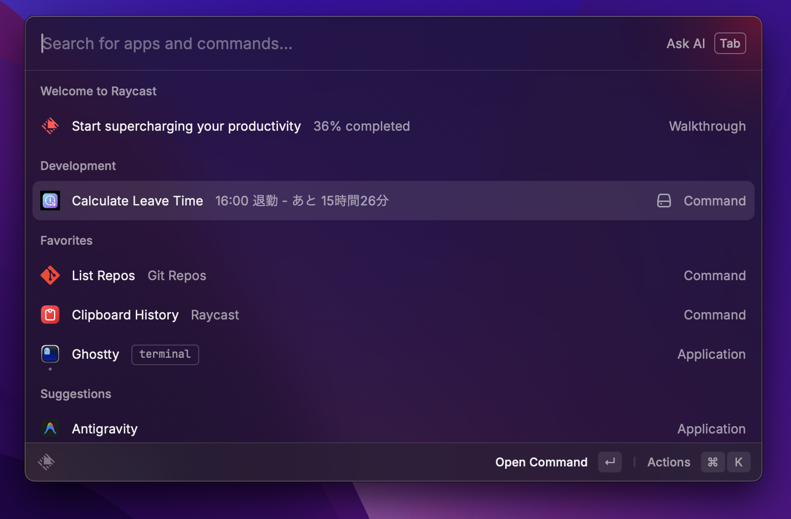
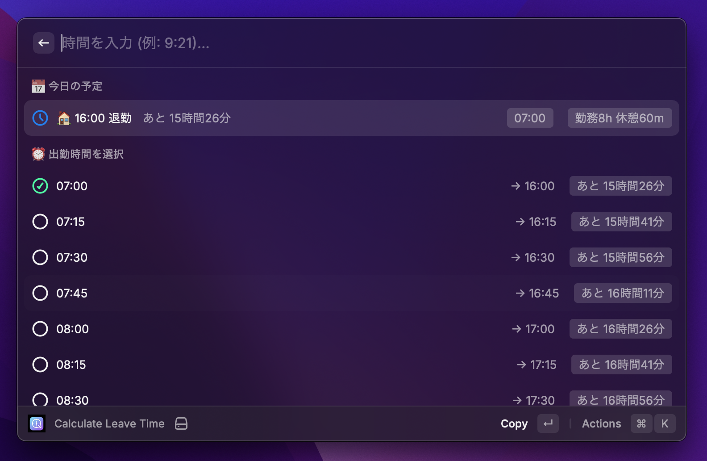

# 退勤時間計算 / Leave Time Calculator

出勤時間を入力するだけで、退勤時間と残り時間がわかるRaycast拡張機能。

## ✨ 機能

- **📅 今日の出勤時間を保存** - 一度設定すれば、その日中ずっと退勤時間を表示
- **⏰ リアルタイム残り時間表示** - 「あと○時間○分」をコマンドリストに動的表示
- **⏱️ 残業中表示** - 退勤時間を過ぎると「○時間○分 残業中」と表示
- **✏️ カスタム時間入力** - 検索バーで `9:21` のように任意の時間を入力可能
- **🌙 深夜シフト対応** - 日をまたぐ勤務も正しく計算
- **🌐 日本語/英語対応** - システム言語に自動追従 or 手動設定

## 📸 スクリーンショット





## 🚀 使い方

1. Raycastで拡張機能を開く
2. 出勤時間をリストから選択（またはカスタム時間を入力）
3. 上部の「今日の予定」に退勤時間と残り時間が表示される
4. 日付が変わると自動的にリセット

## ⚙️ 設定

| 設定項目 | 説明 | デフォルト |
|---------|------|-----------|
| Default Work Hours | 1日の勤務時間 | 8時間 |
| Default Break Minutes | 休憩時間 | 60分 |
| Language / 言語 | 表示言語（System/English/日本語） | System |


## 🛠️ 開発

```bash
# 依存関係インストール
bun install

# 開発モード
bun run dev

# テスト実行
bun run test

# Lint & フォーマットチェック
bun run check

# 自動フォーマット
bun run format

# ビルド
bun run build
```

## 📄 ライセンス

[MIT](LICENSE)
