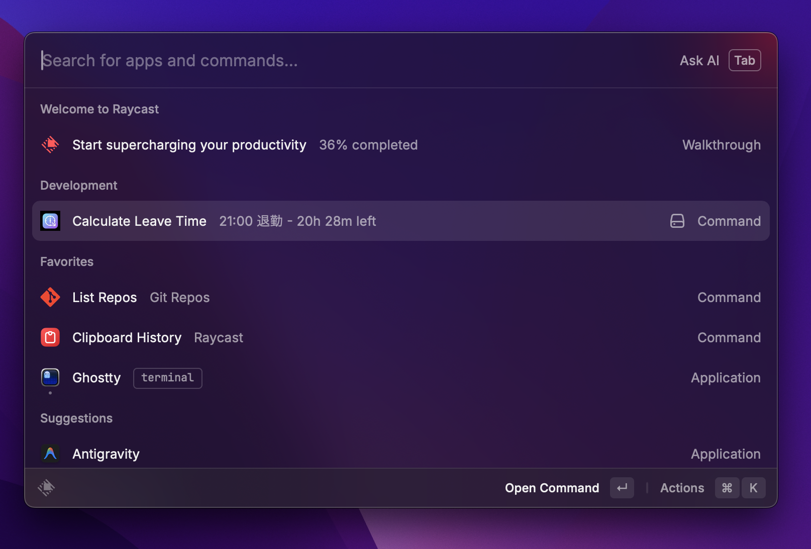
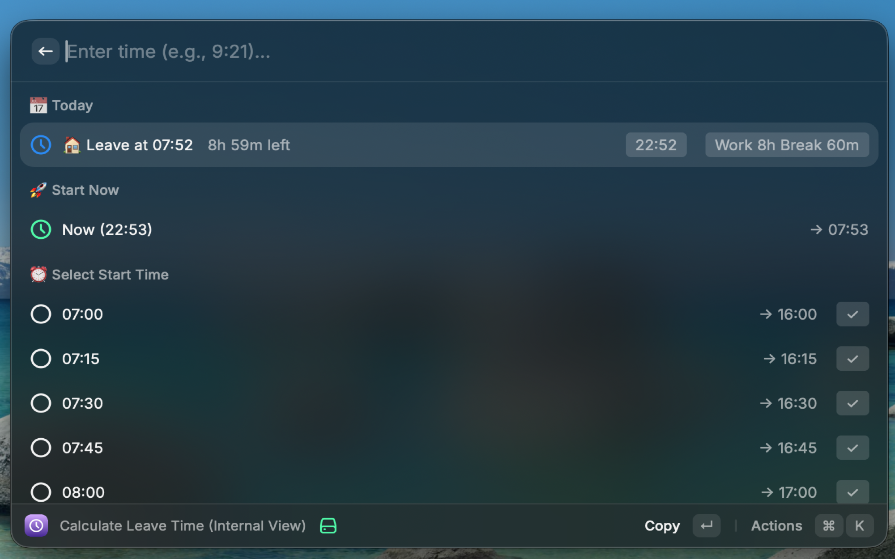
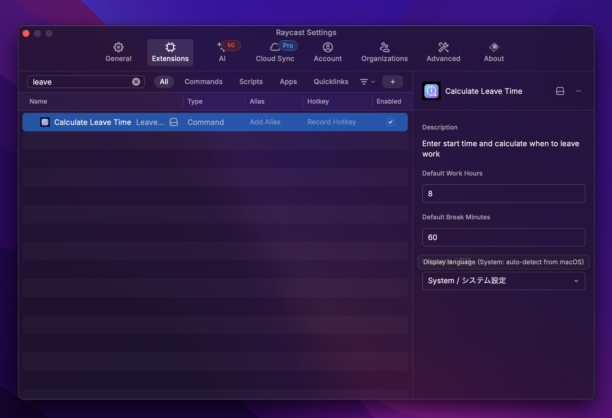

# Leave Time Calculator

A Raycast extension that calculates your leaving time and remaining work hours by simply entering your arrival time.

## ✨ Features

- **📅 Save Today's Arrival Time** - Set it once and see your leaving time all day long
- **⏰ Real-time Remaining Time Display** - Dynamically shows "○ hours ○ minutes left" in the command list
- **⏱️ Overtime Display** - After the scheduled leave time, shows "○ hours ○ minutes overtime"
- **✏️ Custom Time Input** - Enter any time like `9:21` in the search bar
- **🌙 Night Shift Support** - Correctly calculates shifts that span across midnight
- **🌐 Japanese/English Support** - Auto-follows system language or manual setting

## 📸 Screenshots





## 🚀 How to Use

1. Open the extension in Raycast
2. Select arrival time from the list (or enter a custom time)
3. Your leaving time and remaining hours will be displayed in "Today's Schedule" at the top
4. Automatically resets when the date changes

## ⚙️ Settings

| Setting | Description | Default |
|---------|-------------|---------|
| Default Work Hours | Work hours per day | 8 hours |
| Default Break Minutes | Break time | 60 minutes |
| Language / 言語 | Display language (System/English/日本語) | System |



## 🛠️ Development

```bash
# Install dependencies
bun install

# Development mode
bun run dev

# Run tests
bun run test

# Lint & format check
bun run check

# Auto-format
bun run format

# Build
bun run build
```

## 📄 License

[MIT](LICENSE)
